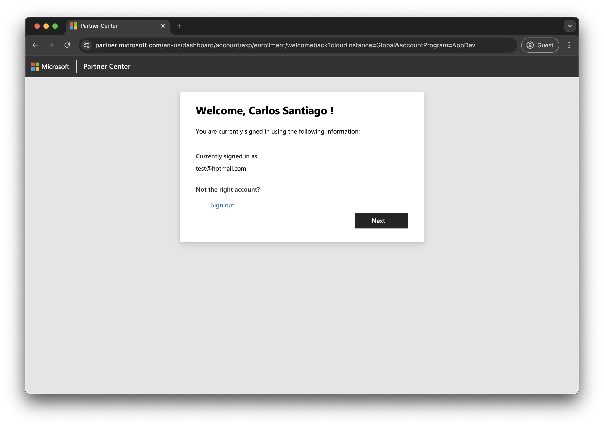
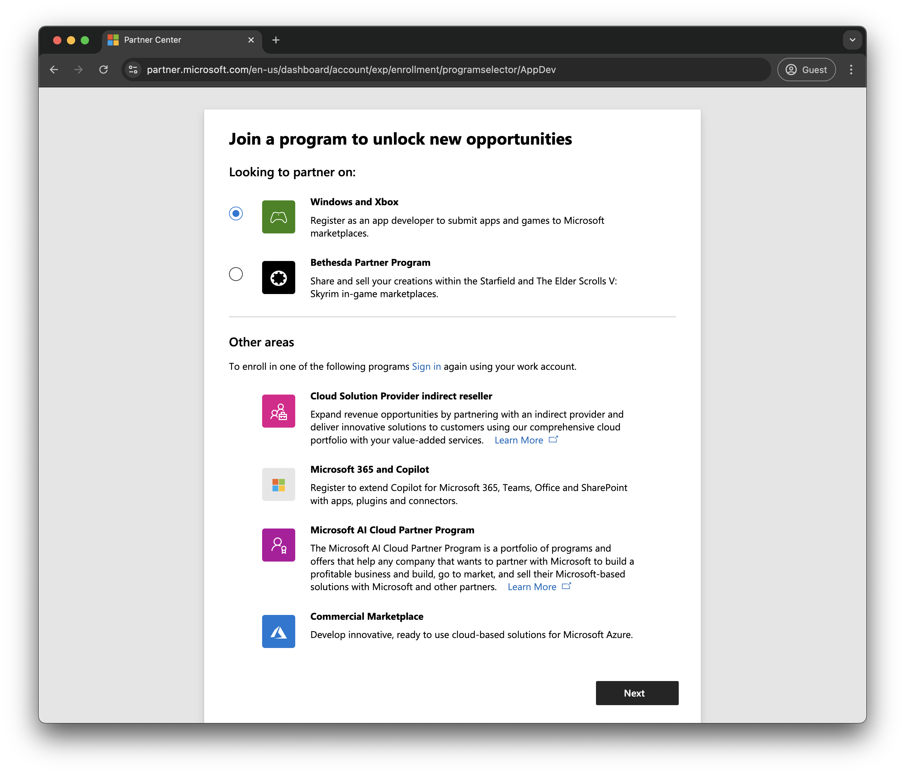
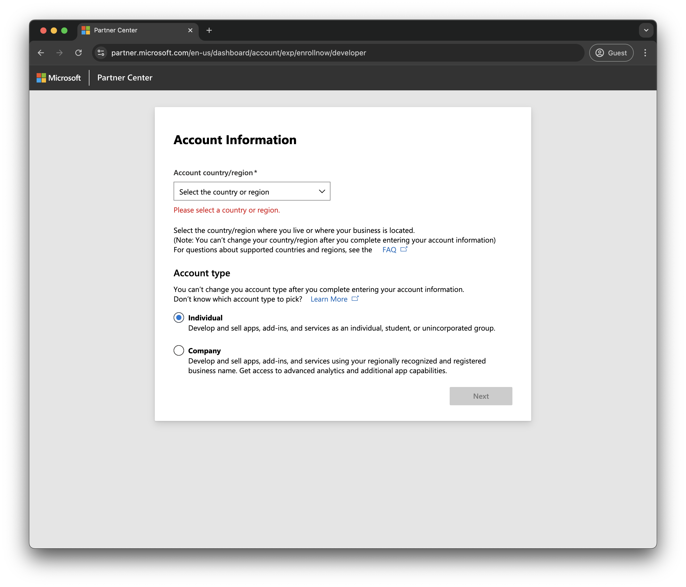
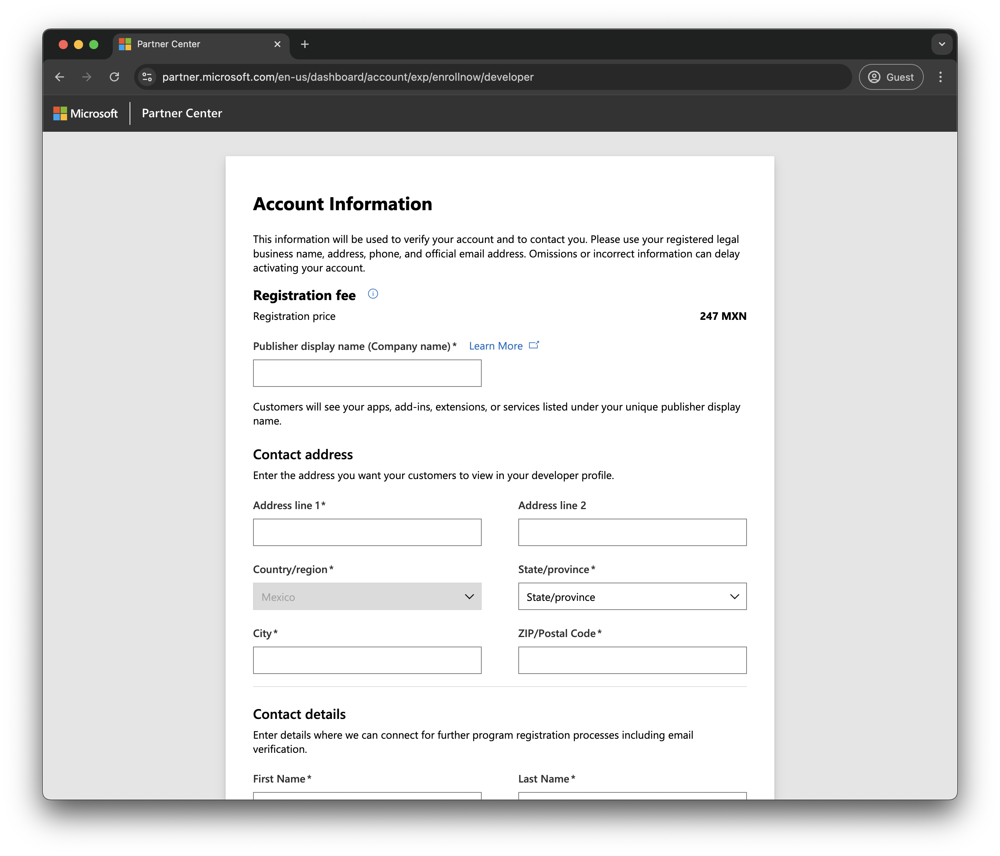
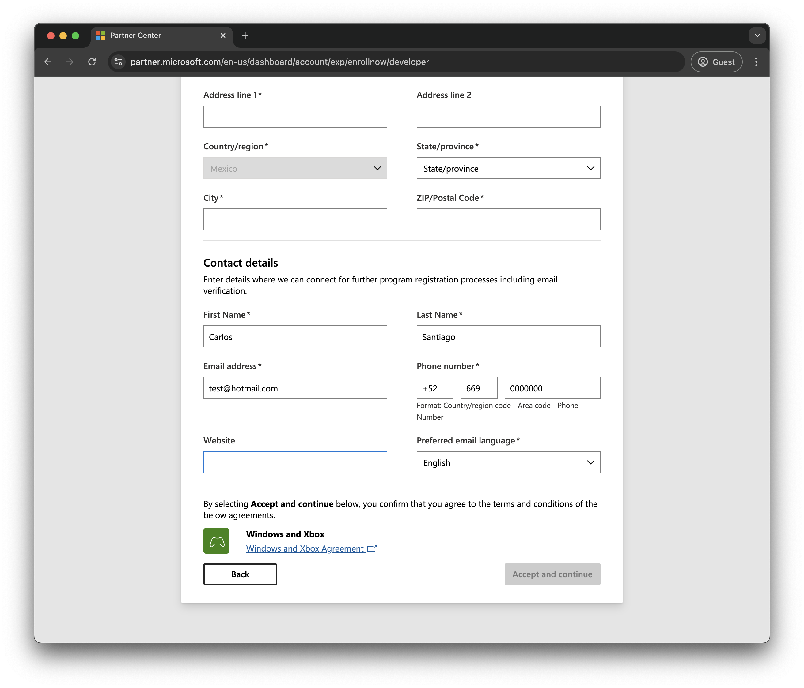

# Configurar modo desarrollador en Xbox One
En este tuturial aprendenremos a como tener el modo desarrollado en nuestra xbox one paso a paso.

## Requerimientos
- Xbox One (Series X, Series S, One X, One S o One Clasica)
- PC con Windows 10 u 11 (MacOS o Linux no nos sera posible)
- Unidad ee Almacenamiento de minimo 64GB ya sea disco duro o USB (3.0)
- Una cuenta de microsoft puede ser nueva o la que usamos en Xbox(**recomendado**)

1. Entramos al siguinete enlace [Sistema Parner de Microsoft](https://partner.microsoft.com/dashboard/registration) el cual nos pedire iniciar sesion con una cuenta microsoft recomendamos que sea la misma que utilizan en Xbox o tambien puede ser una alterna, pero se recomienda que sea la misma y tenga un perfil de Xbox ligado.

2. Al inciair sesion nos aparecera la siguinete pantalla, le daremos en continuar, revisando que la informacion de nuestro nombre y correo corresponda a nuestra cuenta, daremos en next o continuar.

3. En la siguinete pantalla nos aparece a que partner queremos pertenecer en esta caso selecionaremos el **Windows and Xbox** y daremos e siguiente.

4. En la siguiente pantalla nos pedira nuestra region y el tipo de cuenta, aqui seleccionaremos de la region que somos de origen, y el tipo de cuenta en nuestro caso al tratarse de cuentas Microsoft Individuales selecionaremos **Individual**

5. En la siguinete pantalla nos pedira todos nuestros datos, recomendamos llenar su datos completamente reales ya que es importante para Microsoft y su cuenta de Desarrollo que tenga los datos mas reales posibles, en **Publisher display name (Company name)** podremos poner nuestro nombre completo o algun nombre como **Nuestro Nombre Games**, en el apartado **Contact address** agregamois nuestro domicilio o direccion reales, y nos aparecera en nuestra moneda local el costo de la licencia.

6. En el apartado de **Contact details**, agregamos nuestros nombres, correo que puede ser el mismo de microsoft, nuestro numero de telefono, el sitio web es totalmente opccionales, y el idioma preferido, recomiendo que sea en ingles, ya que muchos de los pasos son en ingles.

